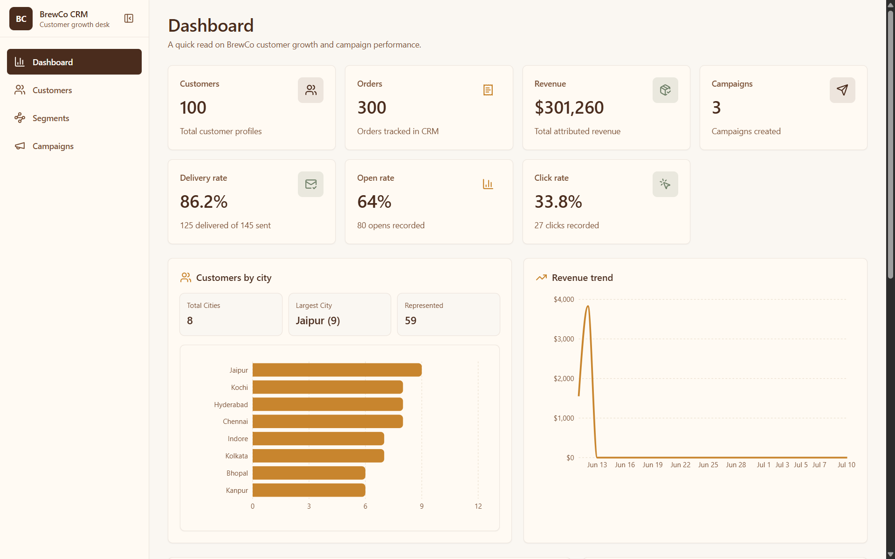
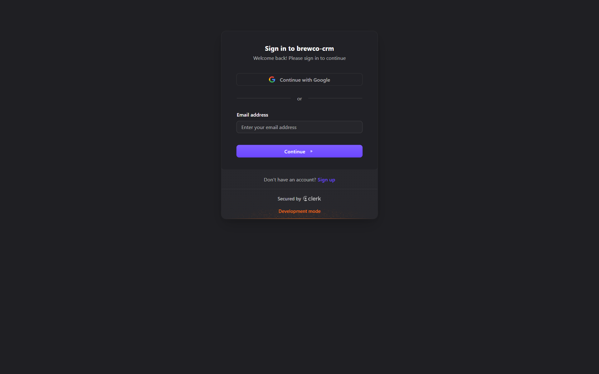
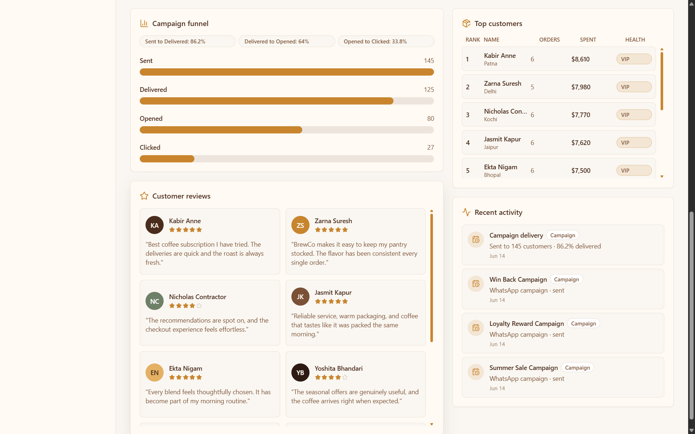
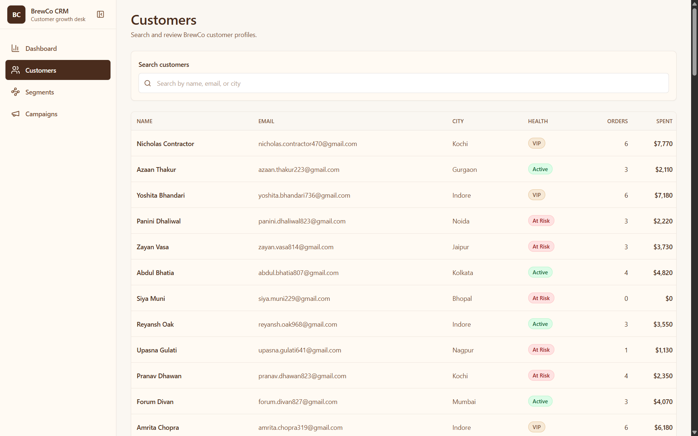
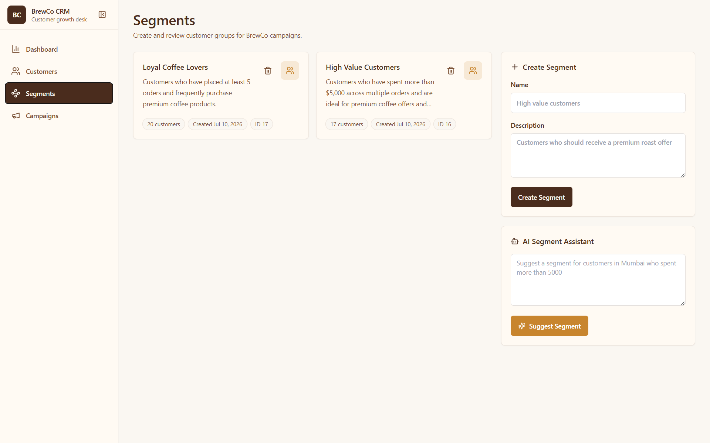
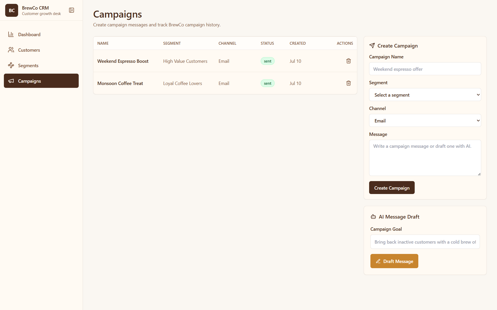
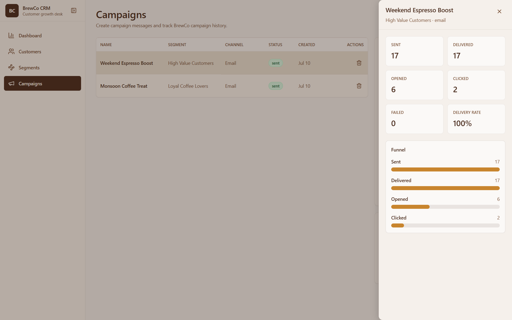

# ☕ BrewCo CRM

> An AI-powered Customer Relationship Management platform for coffee brands — featuring customer segmentation, campaign management, analytics dashboards, and AI-assisted marketing workflows with secure JWT authentication.

---



## 🚀 Live Demo

| Service | URL |
|---|---|
| **Frontend** | https://brewco-crm-pi.vercel.app |
| **Backend API** | https://brewco-crm-backend-7xrd.onrender.com |

> 💡 💡 **Authentication:** Use **Continue with Google** for instant access — no email verification required.

---
## 🎯 Key Highlights

- 🚀 AI-powered CRM using **Groq Llama 3.3**
- 🔐 Secure JWT Authentication with **Clerk**
- ⚛️ Full-Stack application built with **React + FastAPI**
- 🗄️ **Neon PostgreSQL** database
- 🧠 AI-assisted customer segmentation & campaign generation
- 📦 Microservice-based channel delivery with receipt callbacks
- ☁️ Fully deployed on **Vercel**, **Render**, and **Neon**

---

## 🛠 Tech Stack


---

## ✨ Features

- **Customer Management** — Bulk ingestion, profile management, city distribution insights
- **Order Management** — Bulk order ingestion, revenue tracking, order analytics
- **AI Segmentation** — Natural language segment generation via Groq API
- **Campaign Management** — Create campaigns, track delivery, open & click metrics
- **Analytics Dashboard** — Revenue trends, KPIs, campaign funnel, top customers
- **Authentication** — Google Sign-In & Email via Clerk, JWT-secured REST APIs
- **Microservice Architecture** — Separate channel delivery service with receipt callbacks
- **Uptime Monitoring** — Backend kept warm to prevent Render cold starts

---

## 🏗 Architecture

```
┌─────────────────────────────┐
│     React App (Vercel)      │
│   Vite + Tailwind + Axios   │
└──────────────┬──────────────┘
               │ HTTPS + JWT
               ▼
┌─────────────────────────────┐
│     Clerk Authentication    │
│   Google OAuth + Email OTP  │
└──────────────┬──────────────┘
               │ JWT Token
               ▼
┌─────────────────────────────┐
│   FastAPI Backend (Render)  │
│   CRM Service + Groq AI     │
└──────┬───────────────┬──────┘
       │               │
       ▼               ▼
┌────────────┐   ┌────────────┐
│ PostgreSQL │   │  Groq API  │
│  (Neon DB) │   │ AI Features│
└────────────┘   └────────────┘
       │
       ▼
┌─────────────────────────────┐
│  Channel Microservice       │
│  Delivery Simulator (Render)│
└──────────────┬──────────────┘
               │ Receipt Callbacks
               ▼
┌─────────────────────────────┐
│   POST /receipt (CRM API)   │
│  Updates delivery status    │
└─────────────────────────────┘
```

---

## 📁 Project Structure

```
brewco-crm/
├── backend/
│   ├── main.py            # FastAPI CRM service
│   ├── seed.py            # Database seeder (100 customers, 300 orders)
│   ├── schema.sql         # PostgreSQL schema
│   └── requirements.txt
│
├── channel-service/
│   ├── main.py            # Message delivery simulator
│   └── requirements.txt
│
├── frontend/
│   ├── src/
│   │   ├── pages/         # Dashboard, Customers, Segments, Campaigns
│   │   ├── components/    # Reusable UI components
│   │   ├── services/      # Axios API clients
│   │   ├── hooks/         # Custom React hooks
│   │   └── layout/        # AppLayout, Sidebar
│   ├── .env
│   └── package.json
│
└── README.md
```

---

## ⚙️ Local Setup

### 1. Clone Repository

```bash
git clone https://github.com/Debasish65368/brewco-crm.git
cd brewco-crm
```

---

### 2. Backend Setup

```bash
cd backend
python -m venv .venv

# Mac/Linux
source .venv/bin/activate

# Windows
.venv\Scripts\activate

pip install -r requirements.txt
uvicorn main:app --reload
```

Backend runs at: `http://localhost:8000`

**Backend `.env`:**
```env
DATABASE_URL=
GROQ_API_KEY=
CHANNEL_SERVICE_URL=http://localhost:8001/send
CRM_RECEIPT_URL=http://localhost:8000/receipt
CLERK_JWKS_URL=
```

---

### 3. Channel Service Setup

```bash
cd channel-service
pip install -r requirements.txt
uvicorn main:app --port 8001 --reload
```

Channel service runs at: `http://localhost:8001`

---

### 4. Seed Database

```bash
cd backend
python seed.py
```

This inserts 100 customers and 300 orders with realistic Indian data.

---

### 5. Frontend Setup

```bash
cd frontend
npm install
npm run dev
```

Frontend runs at: `http://localhost:5173`

**Frontend `.env`:**
```env
VITE_API_URL=http://localhost:8000
VITE_CLERK_PUBLISHABLE_KEY=
```

---

## 🔐 Authentication Flow

```
User visits app
      ↓
Clerk Login Screen (Google / Email)
      ↓
JWT Token issued by Clerk
      ↓
Axios sends JWT in every request header
      ↓
FastAPI verifies JWT via Clerk JWKS
      ↓
Protected data returned
```

- `/receipt` and `/health` are **public** (called internally by channel service)
- All other routes require a **valid Clerk JWT**

---

## 🤖 AI Features (Groq API)

| Feature | Endpoint | Description |
|---|---|---|
| Segment Suggestion | `POST /ai/suggest-segment` | Natural language → filter JSON |
| Message Drafting | `POST /ai/draft-message` | Campaign goal → message copy |

Model: **Llama 3.3 70B** via Groq

---

## 📊 API Endpoints

| Method | Endpoint | Auth | Description |
|---|---|---|---|
| GET | `/customers` | ✅ | List all customers |
| GET | `/segments` | ✅ | List segments |
| POST | `/segments` | ✅ | Create segment |
| GET | `/campaigns` | ✅ | List campaigns |
| POST | `/campaigns` | ✅ | Create & launch campaign |
| GET | `/dashboard/stats` | ✅ | Dashboard KPIs |
| GET | `/dashboard/revenue-trend` | ✅ | 30-day revenue chart |
| POST | `/ai/suggest-segment` | ✅ | AI segment suggestion |
| POST | `/ai/draft-message` | ✅ | AI message draft |
| POST | `/receipt` | ❌ Public | Delivery callback |
| GET | `/health` | ❌ Public | Health check |

---

## 📸 Screenshots

### Authentication


### Dashboard


### Dashboard Analytics


### Customers


### Segments


### Campaigns


### Campaign Analytics


## 👨‍💻 Author

**Debasish Kumar**
B.Tech CSE | Full Stack Developer

