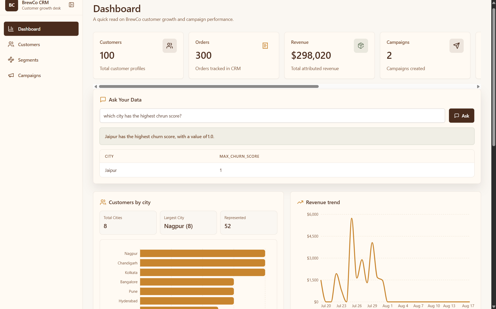
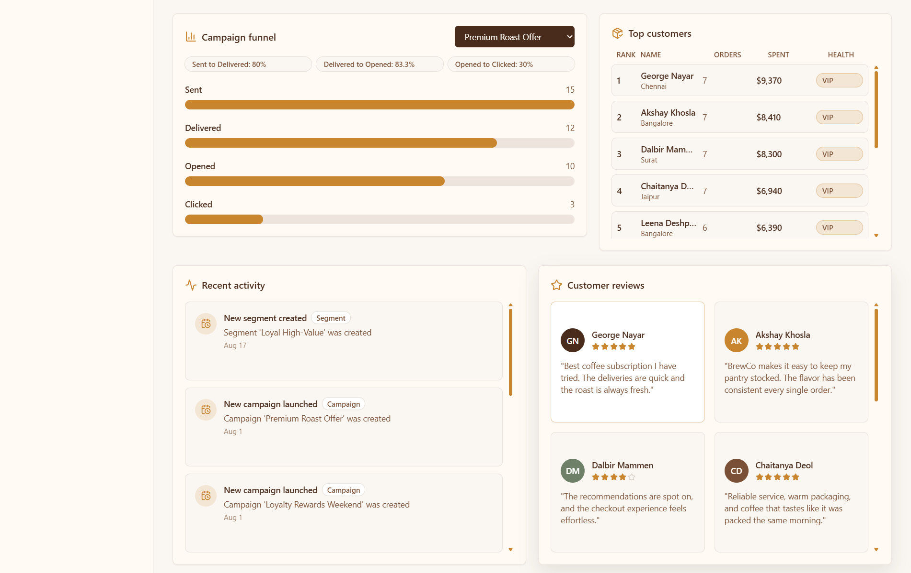
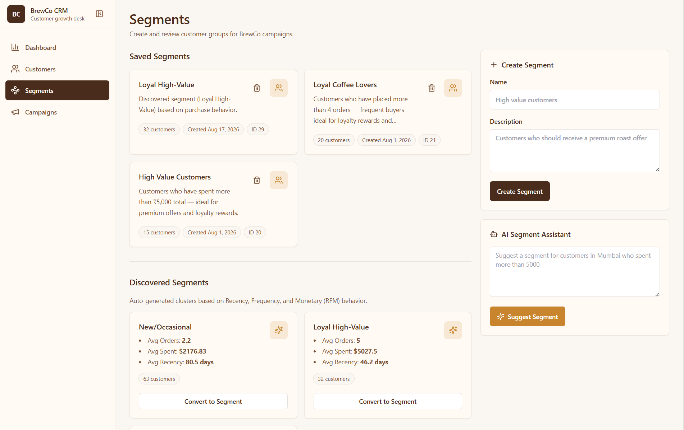
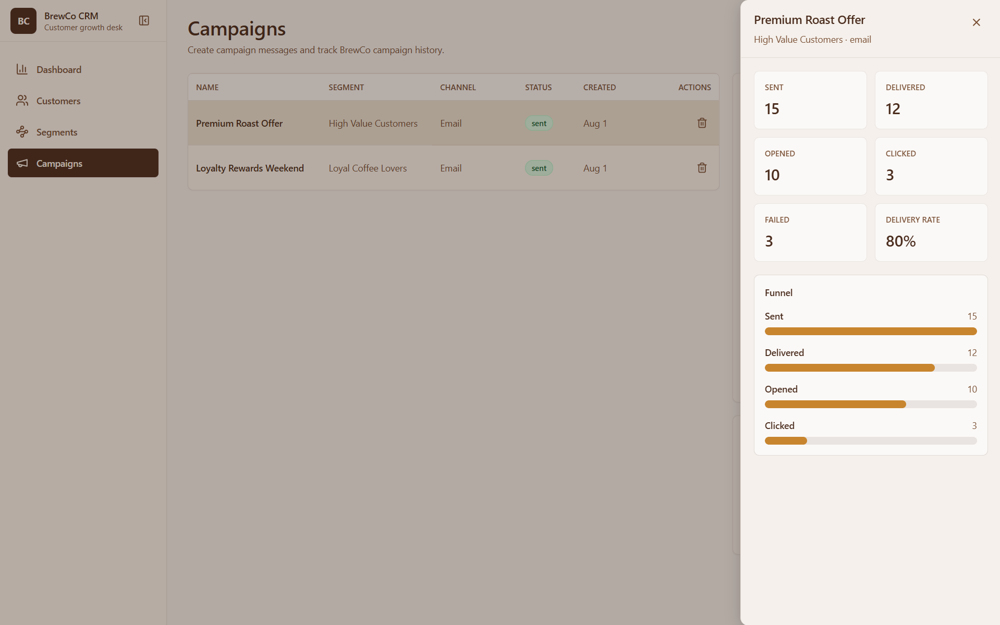

☕ BrewCo CRM

An AI-powered Customer Relationship Management platform for coffee brands — featuring customer segmentation, campaign management, churn prediction, RFM customer clustering, natural-language analytics, and AI-assisted marketing workflows with secure JWT authentication.

Dashboard Preview

🚀 Live Demo

| Service | URL |
|---|---|
| Frontend | https://brewco-crm-pi.vercel.app |
| Backend API | https://brewco-crm-backend-7xrd.onrender.com |

💡 **Authentication:** Use *Continue with Google* for instant access — no email verification required.

## 🎯 Key Highlights

- 🚀 AI-powered CRM using Groq Llama 3.3
- 🔐 Secure JWT Authentication with Clerk
- ⚛️ Full-stack application built with React + FastAPI
- 🗄️ Neon PostgreSQL database
- 🧠 AI-assisted customer segmentation & campaign generation
- 💬 **Natural-language analytics** — ask questions about your data in plain English, get SQL-backed answers
- 📉 **Churn prediction model** — Logistic Regression scoring every customer's churn risk
- 🧩 **RFM customer clustering** — unsupervised KMeans segmentation with automatic cluster-count selection
- 📦 Microservice-based channel delivery with receipt callbacks
- ☁️ Fully deployed on Vercel, Render, and Neon

## 🛠 Tech Stack

`React` `Vite` `TailwindCSS` `FastAPI` `PostgreSQL` `Clerk` `Groq` `Scikit-learn` `Render` `Vercel`

## ✨ Features

- **Customer Management** — Bulk ingestion, profile management, city distribution insights
- **Order Management** — Bulk order ingestion, revenue tracking, order analytics
- **AI Segmentation** — Natural language segment generation via Groq API
- **Campaign Management** — Create campaigns, track delivery, open & click metrics
- **Analytics Dashboard** — Revenue trends, KPIs, campaign funnel, top customers
- **Ask Your Data** — Type a question in plain English (e.g. *"Which city has the highest average churn score?"*); an LLM generates SQL, a validation layer checks it's safe to run, and the result is summarized back in plain English
- **Churn Prediction** — Every customer gets a churn score from a trained Logistic Regression model based on order recency, frequency, and spend
- **RFM Clustering** — Customers are grouped into behavioral segments (e.g. loyal, at-risk, new) via KMeans clustering on Recency/Frequency/Monetary features
- **Authentication** — Google Sign-In & Email via Clerk, JWT-secured REST APIs
- **Microservice Architecture** — Separate channel delivery service with receipt callbacks
- **Uptime Monitoring** — Backend kept warm to prevent Render cold starts

## 🏗 Architecture

```
┌─────────────────────────────┐
│     React App (Vercel)      │
│   Vite + Tailwind + Axios   │
└──────────────┬──────────────┘
               │ HTTPS + JWT
               ▼
┌─────────────────────────────┐
│     Clerk Authentication    │
│   Google OAuth + Email OTP  │
└──────────────┬──────────────┘
               │ JWT Token
               ▼
┌─────────────────────────────┐
│   FastAPI Backend (Render)  │
│  CRM Service + Groq AI +    │
│  ML Scoring (Churn / RFM)   │
└──────┬───────────────┬──────┘
       │               │
       ▼               ▼
┌────────────┐   ┌────────────┐
│ PostgreSQL │   │  Groq API  │
│  (Neon DB) │   │ AI Features│
└────────────┘   └────────────┘
       │
       ▼
┌─────────────────────────────┐
│  Channel Microservice       │
│  Delivery Simulator (Render)│
└──────────────┬──────────────┘
               │ Receipt Callbacks
               ▼
┌─────────────────────────────┐
│   POST /receipt (CRM API)   │
│  Updates delivery status    │
└─────────────────────────────┘
```

## 🧠 Machine Learning Layer

### Churn Prediction

A **Logistic Regression** model scores every customer's likelihood of churning, trained on order-derived features (total orders, total spend, days since last order, average order value). Labels are generated from a weighted recency/frequency/monetary risk score rather than historical churn outcomes — an explainable, rule-grounded approach rather than a black-box label source. Scores are refreshed via a scheduled update script (`update_churn_scores.py`) rather than computed once and left stale.

### RFM Customer Clustering

Customers are grouped into behavioral segments using **KMeans clustering** on standardized Recency, Frequency, and Monetary features. Rather than hardcoding a cluster count, the training script (`train_rfm_clusters.py`) tests k = 2 through 8 and selects the value that maximizes **silhouette score** — letting the data determine the natural number of customer segments instead of guessing. Cluster assignments refresh via `update_customer_clusters.py`.

### Ask Your Data — Natural Language Analytics

A two-stage Groq LLM pipeline: the user's question is converted into a read-only SQL query, then the query result is summarized back in plain English. This isn't a naive "LLM writes SQL and runs it" implementation — every generated query passes through `sql_guard.py`, a validation layer built specifically to prevent PII exposure and unsafe execution.

## 🔐 Security Hardening: Two Real Bypasses Found and Fixed

Building `sql_guard.py` wasn't a single pass — adversarial testing surfaced two genuine PII-leak vulnerabilities during development, both fixed before shipping:

**1. The `SELECT *` bypass.** The initial PII check searched the generated SQL for the literal words `email`/`phone`. A query like `SELECT * FROM customers` contains neither word, so it passed validation while still returning every column, PII included, once executed.
→ **Fix:** any bare `*` outside `COUNT(*)` is now rejected outright, forcing every query to name columns explicitly.

**2. The aggregate-function bypass.** The next check allowed `email`/`phone` through as long as *some* aggregate function wrapped them — correct for `COUNT(email)` (returns a number, safe) but wrong for `STRING_AGG(email, ', ')` or `ARRAY_AGG(phone)` (return the actual PII values, concatenated). A query asking to "show all customer emails" got past validation and returned real data for all 100 customers.
→ **Fix:** `email`/`phone` are now permitted inside `COUNT()` only — any other aggregate wrapping them is rejected.

Every fix was verified against adversarial test cases (DROP/UPDATE injection attempts, semicolon-based multi-statement injection, disallowed tables, direct and aggregate-wrapped PII selection) before being considered resolved.

## 📁 Project Structure

```
brewco-crm/
├── backend/
│   ├── main.py                    # FastAPI CRM service
│   ├── routers/                   # API route handlers (customers, segments, campaigns, analytics)
│   ├── clients/
│   │   └── ai_client.py           # Groq LLM integration (segmentation, SQL generation, summarization)
│   ├── services/
│   │   └── sql_guard.py           # SQL validation & PII protection layer
│   ├── scripts/
│   │   ├── train_churn_model.py
│   │   ├── train_rfm_clusters.py
│   │   ├── update_churn_scores.py
│   │   └── update_customer_clusters.py
│   ├── models/                    # churn_model.pkl, rfm_model.pkl, rfm_scaler.pkl
│   ├── seed.py                    # Database seeder (100 customers, 300 orders)
│   ├── schema.sql                 # PostgreSQL schema
│   └── requirements.txt
│
├── channel-service/
│   ├── main.py                    # Message delivery simulator
│   └── requirements.txt
│
├── frontend/
│   ├── src/
│   │   ├── pages/                 # Dashboard, Customers, Segments, Campaigns
│   │   ├── components/            # Reusable UI components
│   │   ├── services/               # Axios API clients (incl. analyticsApi.js)
│   │   ├── hooks/                  # Custom React hooks
│   │   └── layout/                 # AppLayout, Sidebar
│   └── package.json
│
├── Screenshots/
├── .gitignore
└── README.md
```

## ⚙️ Local Setup

### 1. Clone Repository
```bash
git clone https://github.com/Debasish65368/brewco-crm.git
cd brewco-crm
```

### 2. Backend Setup
```bash
cd backend
python -m venv .venv

# Mac/Linux
source .venv/bin/activate
# Windows
.venv\Scripts\activate

pip install -r requirements.txt
uvicorn main:app --reload
```
Backend runs at: `http://localhost:8000`

Backend `.env`:
```
DATABASE_URL=
GROQ_API_KEY=
CHANNEL_SERVICE_URL=http://localhost:8001/send
CRM_RECEIPT_URL=http://localhost:8000/receipt
CLERK_JWKS_URL=
```

### 3. Channel Service Setup
```bash
cd channel-service
pip install -r requirements.txt
uvicorn main:app --port 8001 --reload
```
Channel service runs at: `http://localhost:8001`

### 4. Train / Refresh ML Models (optional — pretrained artifacts are included)
```bash
cd backend
python scripts/train_churn_model.py
python scripts/train_rfm_clusters.py
```

### 5. Seed Database
```bash
cd backend
python seed.py
```
Inserts 100 customers and 300 orders with realistic Indian data.

### 6. Frontend Setup
```bash
cd frontend
npm install
npm run dev
```
Frontend runs at: `http://localhost:5173`

Frontend `.env`:
```
VITE_API_URL=http://localhost:8000
VITE_CLERK_PUBLISHABLE_KEY=
```

## 🔐 Authentication Flow

```
User visits app
      ↓
Clerk Login Screen (Google / Email)
      ↓
JWT Token issued by Clerk
      ↓
Axios sends JWT in every request header
      ↓
FastAPI verifies JWT via Clerk JWKS
      ↓
Protected data returned
```
`/receipt` and `/health` are public (called internally by the channel service). All other routes require a valid Clerk JWT.

## 🤖 AI Features (Groq API — Llama 3.3 70B)

| Feature | Endpoint | Description |
|---|---|---|
| Segment Suggestion | `POST /ai/suggest-segment` | Natural language → filter JSON |
| Message Drafting | `POST /ai/draft-message` | Campaign goal → message copy |
| Ask Your Data | `POST /analytics/query` | Natural language question → validated SQL → plain-English answer |

## 📊 API Endpoints

| Method | Endpoint | Auth | Description |
|---|---|---|---|
| GET | `/customers` | ✅ | List all customers |
| GET | `/segments` | ✅ | List segments |
| POST | `/segments` | ✅ | Create segment |
| GET | `/campaigns` | ✅ | List campaigns |
| POST | `/campaigns` | ✅ | Create & launch campaign |
| GET | `/dashboard/stats` | ✅ | Dashboard KPIs |
| GET | `/dashboard/revenue-trend` | ✅ | 30-day revenue chart |
| POST | `/ai/suggest-segment` | ✅ | AI segment suggestion |
| POST | `/ai/draft-message` | ✅ | AI message draft |
| POST | `/analytics/query` | ✅ | Ask Your Data — NL question → SQL → answer |
| POST | `/receipt` | ❌ Public | Delivery callback |
| GET | `/health` | ❌ Public | Health check |

## 📸 Screenshots

**Authentication**


**Dashboard**


**Dashboard — Ask Your Data & Analytics**


**Customers**


**Segments**


**Campaigns**


**Campaign Analytics**


## 👨‍💻 Author

**Debasish Kumar**
B.Tech CSE | Full Stack Developer