<div align="center">

# ☕ BrewCo CRM

### A CRM for a coffee brand: customer analytics, RFM segments, churn scoring, campaigns with delivery tracking, and a natural-language "Ask Your Data" box backed by a validated, parameterized query builder.


**2 FastAPI services · 5 PostgreSQL tables · 19 CRM endpoints (17 behind Clerk JWT) · 2 scikit-learn models · 5 security and correctness test scripts**

</div>

---

## 🚀 Live Demo

| Resource | Link |
|---|---|
| Frontend | https://brewco-crm-pi.vercel.app |
| Backend API | https://brewco-crm-backend-7xrd.onrender.com |
| Repository | https://github.com/Debasish65368/brewco-crm |

💡 **Sign-in:** unauthenticated visitors are redirected to Clerk; on the live instance, *Continue with Google* is quickest. Demo data is **synthetic** (100 customers, 300 orders) and delivery is **simulated**.

---

## 📖 Table of Contents

- [Overview](#-overview)
- [Features](#-features)
- [System Architecture](#️-system-architecture)
- [End-to-End Product Flow](#-end-to-end-product-flow)
- [Authentication Flow](#-authentication-flow)
- [Ask Your Data: AI Analytics Pipeline](#-ask-your-data-ai-analytics-pipeline)
- [AI / PII Boundary](#️-ai--pii-boundary)
- [Segmentation and ML Layer](#-segmentation-and-ml-layer)
- [Campaign Delivery Pipeline](#-campaign-delivery-pipeline)
- [Data Model](#️-data-model)
- [API Endpoints](#-api-endpoints)
- [Security Hardening](#-security-hardening)
- [Frontend and Backend Structure](#-frontend-and-backend-structure)
- [Local Setup](#️-local-setup)
- [Deployment](#-deployment)
- [Screenshots and Walkthrough](#-screenshots-and-walkthrough)
- [Engineering Decisions](#-engineering-decisions)
- [Testing](#-testing)
- [Known Limitations](#️-known-limitations)
- [Future Work](#-future-work)
- [Tech Stack](#-tech-stack)

---

## 🧭 Overview

BrewCo CRM is a full-stack CRM for a fictional coffee brand, built for a marketing user who needs to see customers, group them, message them, and check what happened. The interesting parts are the boundaries: an **LLM that only emits a schema-constrained query spec** instead of raw SQL, a **shared-secret callback** from a separate delivery service, and **JWT verification against Clerk's JWKS**.

| Question a coffee brand asks | How BrewCo answers it |
|---|---|
| *Who are my customers?* | KMeans on recency / frequency / spend produces discovered segments, which convert into targetable ones |
| *Who might leave?* | A logistic-regression `churn_score` (trained on rule-derived labels, see [limits](#️-known-limitations)) drives the "At Risk" badge |
| *What does my data say?* | A plain-English question becomes a validated query spec, a parameterized query, and a short summary |
| *Did the campaign work?* | A separate channel service simulates delivery and posts receipts back, feeding a per-campaign funnel |

**AI:** Groq (`openai/gpt-oss-120b`) suggests segment filters, drafts campaign copy, generates query specs, and summarizes results. **ML:** two scikit-learn models run in offline scripts, never in the request path.

---

## ✨ Features

| Area | What it does |
|---|---|
| 📊 **Dashboard** | KPI cards, 30-day revenue trend, customers-by-city chart, top customers, recent activity, per-campaign funnel |
| 👥 **Customers** | Searchable list (name, email, city) with a detail panel and a VIP / At Risk / Active health badge |
| 🎯 **Segments** | Filter-based segments with strict validation, an AI assistant that suggests filters, and auto-labeled RFM clusters convertible to segments |
| 🤖 **Ask Your Data** | Natural-language analytics over an allow-listed subset of columns (see the [pipeline](#-ask-your-data-ai-analytics-pipeline)) |
| 📣 **Campaigns** | Create for a segment over email / SMS / WhatsApp (labels only), AI-drafted copy, live stats drawer, delete |
| 📡 **Delivery tracking** | Sent → delivered / failed → opened → clicked, written by receipt callbacks |
| 🔐 **Authentication** | Clerk sign-in in the browser, RS256 JWT verified by FastAPI on 17 routes |
| 📱 **Responsive shell** | Collapsible desktop sidebar, slide-over mobile navigation |

---

## 🏗️ System Architecture

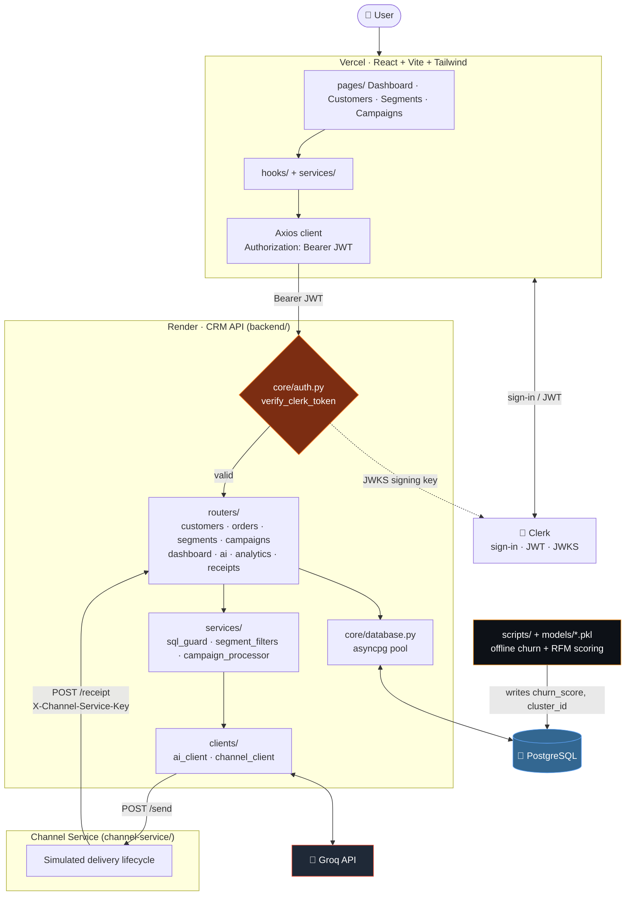
```mermaid
flowchart TB
    User(["👤 User"])

    subgraph FE["Vercel · React + Vite + Tailwind"]
        direction TB
        Pages["pages/ Dashboard · Customers · Segments · Campaigns"]
        Hooks["hooks/ + services/"]
        Axios["Axios client<br/>Authorization: Bearer JWT"]
        Pages --> Hooks --> Axios
    end

    Clerk["🔐 Clerk<br/>sign-in · JWT · JWKS"]

    subgraph CRM["Render · CRM API (backend/)"]
        direction TB
        Auth{"core/auth.py<br/>verify_clerk_token"}
        Routers["routers/<br/>customers · orders · segments · campaigns<br/>dashboard · ai · analytics · receipts"]
        Svc["services/<br/>sql_guard · segment_filters · campaign_processor"]
        Cli["clients/<br/>ai_client · channel_client"]
        Pool["core/database.py<br/>asyncpg pool"]
        Auth -- "valid" --> Routers --> Svc
        Routers --> Pool
        Svc --> Cli
    end

    subgraph CS["Channel Service (channel-service/)"]
        Sim["Simulated delivery lifecycle"]
    end

    Scripts["scripts/ + models/*.pkl<br/>offline churn + RFM scoring"]
    DB[("🐘 PostgreSQL")]
    Groq["🧠 Groq API"]

    User --> FE
    FE <-- "sign-in / JWT" --> Clerk
    Axios -- "Bearer JWT" --> Auth
    Auth -. "JWKS signing key" .-> Clerk
    Pool <--> DB
    Cli <--> Groq
    Cli -- "POST /send" --> Sim
    Sim -- "POST /receipt<br/>X-Channel-Service-Key" --> Routers
    Scripts -- "writes churn_score, cluster_id" --> DB

    style Auth fill:#7c2d12,color:#fff,stroke:#f97316
    style Groq fill:#1f2937,color:#fff,stroke:#F55036
    style DB fill:#336791,color:#fff,stroke:#60a5fa
    style Scripts fill:#0d1117,color:#fff,stroke:#F7931E
```

| Component | Responsibility |
|---|---|
| **Frontend** | Four routed pages behind Clerk's `SignedIn` gate; an Axios interceptor attaches the session token. |
| **CRM API** | Auth gate, business logic, SQL access; `services/` holds the validators and dispatcher, `clients/` wraps Groq and the channel service. |
| **Channel service** | Standalone FastAPI app: accepts `/send`, simulates delivery, reports to `/receipt`. |
| **Offline scripts** | Train and apply the churn and RFM models, writing results into `customers`. |

---

## 🔄 End-to-End Product Flow

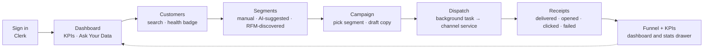
```mermaid
flowchart LR
    A["Sign in<br/>Clerk"] --> B["Dashboard<br/>KPIs · Ask Your Data"]
    B --> C["Customers<br/>search · health badge"]
    C --> D["Segments<br/>manual · AI-suggested · RFM-discovered"]
    D --> E["Campaign<br/>pick segment · draft copy"]
    E --> F["Dispatch<br/>background task → channel service"]
    F --> G["Receipts<br/>delivered · opened · clicked · failed"]
    G --> H["Funnel + KPIs<br/>dashboard and stats drawer"]
    H -.-> B
```

---

## 🔐 Authentication Flow

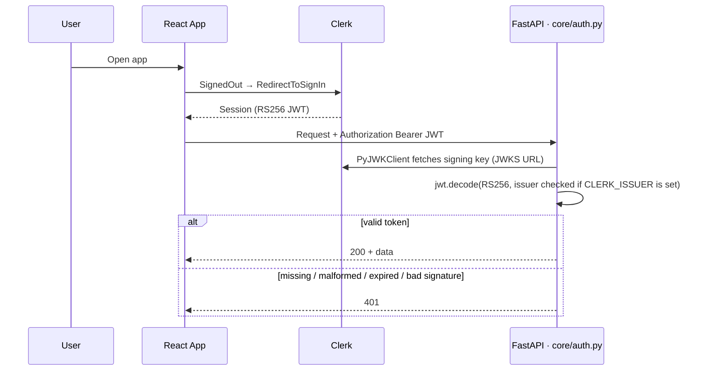
```mermaid
sequenceDiagram
    participant U as User
    participant FE as React App
    participant Clerk as Clerk
    participant API as FastAPI · core/auth.py

    U->>FE: Open app
    FE->>Clerk: SignedOut → RedirectToSignIn
    Clerk-->>FE: Session (RS256 JWT)
    FE->>API: Request + Authorization Bearer JWT
    API->>Clerk: PyJWKClient fetches signing key (JWKS URL)
    API->>API: jwt.decode(RS256, issuer checked if CLERK_ISSUER is set)
    alt valid token
        API-->>FE: 200 + data
    else missing / malformed / expired / bad signature
        API-->>FE: 401
    end
```

`verify_clerk_token` guards 17 routes. `/receipt` uses a shared secret instead, and `/` is a public status route. Audience verification is disabled and the token payload is not used for per-user authorization, so any valid Clerk user has full access: the app is **single-tenant** by design.

---

## 🔎 Ask Your Data: AI Analytics Pipeline

The model never writes SQL. It returns a JSON **query spec**, and the server builds the SQL.

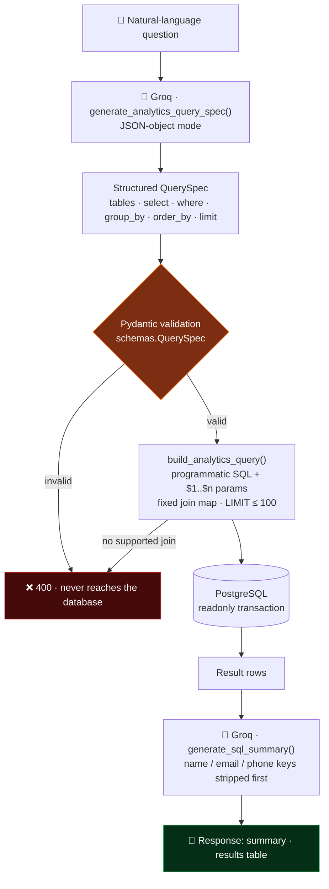
```mermaid
flowchart TB
    Q["💬 Natural-language question"]
    L1["🧠 Groq · generate_analytics_query_spec()<br/>JSON-object mode"]
    Spec["Structured QuerySpec<br/>tables · select · where · group_by · order_by · limit"]
    V{"Pydantic validation<br/>schemas.QuerySpec"}
    Rej["❌ 400 · never reaches the database"]
    B["build_analytics_query()<br/>programmatic SQL + $1..$n params<br/>fixed join map · LIMIT ≤ 100"]
    X[("PostgreSQL<br/>readonly transaction")]
    Res["Result rows"]
    S["🧠 Groq · generate_sql_summary()<br/>name / email / phone keys stripped first"]
    Out["📝 Response: summary · results table"]

    Q --> L1 --> Spec --> V
    V -- "invalid" --> Rej
    V -- "valid" --> B
    B -- "no supported join" --> Rej
    B --> X --> Res --> S --> Out

    style Rej fill:#450a0a,color:#fff,stroke:#dc2626
    style V fill:#7c2d12,color:#fff,stroke:#f97316
    style Out fill:#052e16,color:#fff,stroke:#22c55e
```

What the validator enforces (`schemas.py`, `services/sql_guard.py`):

- **Closed vocabulary:** tables, columns, aggregates (`COUNT/SUM/AVG/MIN/MAX`), operators, and sort directions are `Literal` types, so identifiers are never free text.
- **Per-table column allow-list** (`VALID_TABLE_COLUMNS`): `customers` exposes `id, city, total_orders, total_spent, last_order_date, churn_score, cluster_id, created_at`. No `name`, `email`, or `phone`.
- **Values are bound parameters:** filter values become `$1..$n`, never string-formatted.
- **Joins come from a fixed map** (customers↔orders, segments↔campaigns, campaigns↔communications, customers↔communications); anything else is rejected.
- **Bounded output:** `limit` must be ≤ 100, and execution runs inside `conn.transaction(readonly=True)`.

---

## 🛡️ AI / PII Boundary

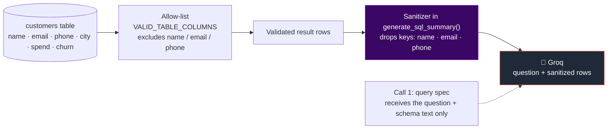
```mermaid
flowchart LR
    DB[("customers table<br/>name · email · phone · city · spend · churn")]
    AL["Allow-list<br/>VALID_TABLE_COLUMNS<br/>excludes name / email / phone"]
    R["Validated result rows"]
    F["Sanitizer in generate_sql_summary()<br/>drops keys: name · email · phone"]
    G["🧠 Groq<br/>question + sanitized rows"]

    DB --> AL --> R --> F --> G

    P1["Call 1: query spec<br/>receives the question + schema text only"] -.-> G
    style F fill:#3b0764,color:#fff,stroke:#8A2BE2
    style G fill:#1f2937,color:#fff,stroke:#F55036
```

Two independent controls sit on this path. Upstream, the allow-list means identity columns cannot be selected at all. Downstream, the summarizer drops `name`, `email`, and `phone` keys from every row before building the prompt; `tests_analytics_pii_security.py` mocks Groq and asserts none of those values reach it. The prompt also labels result rows as data, not instructions.

**What does reach Groq:** the free-text question, the schema description, and allow-listed result values such as city, spend, and churn score. The segment-suggestion and message-drafting calls include the user's supplied text plus fixed application instructions (role description, required format, supported fields); they do not receive customer records. The Customers page shows names, emails, and phones to signed-in users via `GET /customers`, outside the AI path.

---

## 🧠 Segmentation and ML Layer

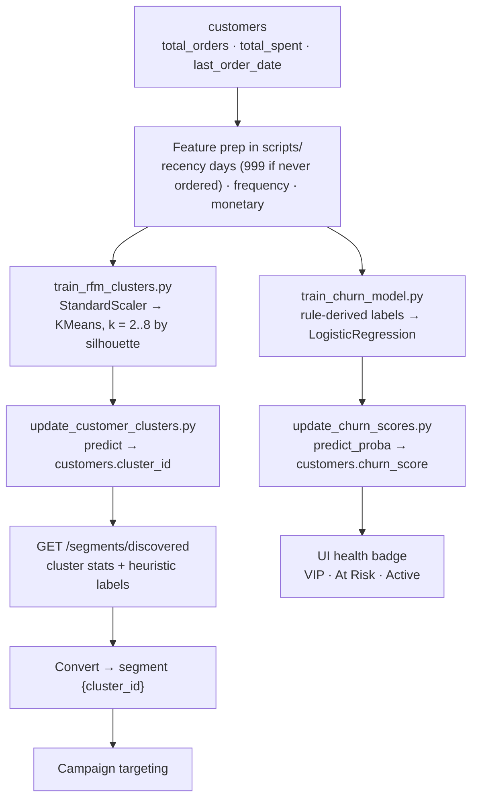
```mermaid
flowchart TD
    A["customers<br/>total_orders · total_spent · last_order_date"]
    B["Feature prep in scripts/<br/>recency days (999 if never ordered) · frequency · monetary"]
    C1["train_churn_model.py<br/>rule-derived labels → LogisticRegression"]
    C2["train_rfm_clusters.py<br/>StandardScaler → KMeans, k = 2..8 by silhouette"]
    D1["update_churn_scores.py<br/>predict_proba → customers.churn_score"]
    D2["update_customer_clusters.py<br/>predict → customers.cluster_id"]
    E["GET /segments/discovered<br/>cluster stats + heuristic labels"]
    F["Convert → segment {cluster_id}"]
    G["Campaign targeting"]
    H["UI health badge<br/>VIP · At Risk · Active"]

    A --> B --> C1 --> D1 --> H
    B --> C2 --> D2 --> E --> F --> G
```

**Churn score.** `LogisticRegression(C=0.1, max_iter=1000)` on four features: orders, spend, days since last order, average order value. The dataset has no real churn outcomes, so labels are **pseudo-labels** from a hand-set rule:

```
composite_risk = 0.5·min(days/90, 1) + 0.3·1/(1+orders) + 0.2·1/(1+spend/1000)
is_churned     = composite_risk > 0.5
```

Because the label is a function of nearly the same inputs, the model is best read as a smooth approximation of that rule, not a validated predictor; no hold-out evaluation is recorded. The UI badge: VIP if orders > 4 and spend > 5000, else At Risk if `churn_score` > 0.70, else Active.

**RFM clusters.** KMeans over standardized recency, frequency, and monetary values. The training script picks k from 2–8 by best silhouette score (`random_state=42`); the score is printed at training time and not stored. Cluster IDs are written to `customers.cluster_id`. Human-readable names are assigned **at request time by a heuristic** in `routers/segments.py`: highest orders×spend → *Loyal High-Value*, then highest recency → *At Risk*, lowest orders → *New/Occasional*, highest spend → *High Spenders*, remainder → *Standard Group*.

Models are pickles in `backend/models/`, loaded only by the scripts. Scoring is **manual**: new customers keep default scores until the scripts rerun.

---

## 📣 Campaign Delivery Pipeline

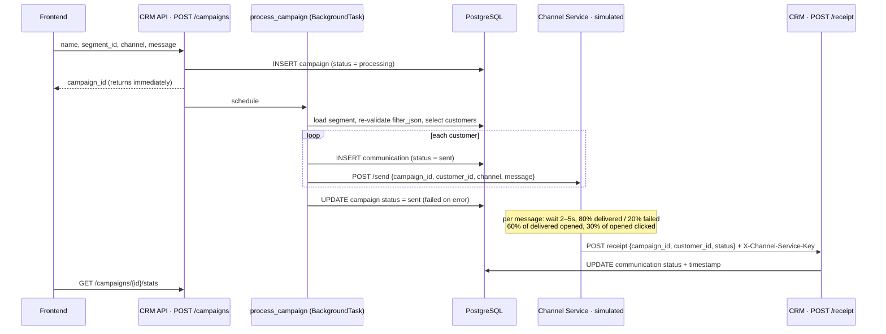
```mermaid
sequenceDiagram
    participant FE as Frontend
    participant API as CRM API · POST /campaigns
    participant BG as process_campaign (BackgroundTask)
    participant DB as PostgreSQL
    participant CS as Channel Service · simulated
    participant RC as CRM · POST /receipt

    FE->>API: name, segment_id, channel, message
    API->>DB: INSERT campaign (status = processing)
    API-->>FE: campaign_id (returns immediately)
    API->>BG: schedule
    BG->>DB: load segment, re-validate filter_json, select customers
    loop each customer
        BG->>DB: INSERT communication (status = sent)
        BG->>CS: POST /send {campaign_id, customer_id, channel, message}
    end
    BG->>DB: UPDATE campaign status = sent (failed on error)
    Note over CS: per message: wait 2–5s, 80% delivered / 20% failed<br/>60% of delivered opened, 30% of opened clicked
    CS->>RC: POST receipt {campaign_id, customer_id, status} + X-Channel-Service-Key
    RC->>DB: UPDATE communication status + timestamp
    FE->>API: GET /campaigns/{id}/stats
```

**The channel service is a simulator.** Nothing is emailed, texted, or sent to WhatsApp; the channel names are labels and outcomes come from `random`. A campaign's `sent` status means "handed to the channel service", not "delivered".

**Callback boundary.** The CRM's `/send` payload no longer carries a callback URL; the channel service reads its destination from its own `CRM_RECEIPT_URL` env var, so a caller cannot redirect receipts. `/receipt` requires an `X-Channel-Service-Key` header compared with `hmac.compare_digest` (401 if absent, 403 if wrong, 500 if the server secret is unset) and only accepts the four known statuses.

---

## 🗃️ Data Model

The repository ships **no DDL file**, so this model is reconstructed from the queries and two migration scripts. Relationships are shown as the code uses them; database-level constraints are not verified.

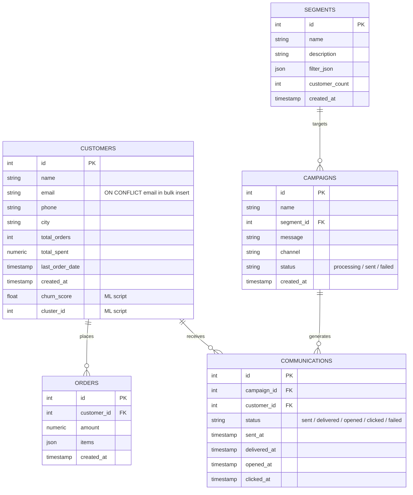
```mermaid
erDiagram
    CUSTOMERS {
        int id PK
        string name
        string email "ON CONFLICT email in bulk insert"
        string phone
        string city
        int total_orders
        numeric total_spent
        timestamp last_order_date
        timestamp created_at
        float churn_score "ML script"
        int cluster_id "ML script"
    }
    ORDERS {
        int id PK
        int customer_id FK
        numeric amount
        json items
        timestamp created_at
    }
    SEGMENTS {
        int id PK
        string name
        string description
        json filter_json
        int customer_count
        timestamp created_at
    }
    CAMPAIGNS {
        int id PK
        string name
        int segment_id FK
        string message
        string channel
        string status "processing / sent / failed"
        timestamp created_at
    }
    COMMUNICATIONS {
        int id PK
        int campaign_id FK
        int customer_id FK
        string status "sent / delivered / opened / clicked / failed"
        timestamp sent_at
        timestamp delivered_at
        timestamp opened_at
        timestamp clicked_at
    }

    CUSTOMERS ||--o{ ORDERS : places
    CUSTOMERS ||--o{ COMMUNICATIONS : receives
    SEGMENTS ||--o{ CAMPAIGNS : targets
    CAMPAIGNS ||--o{ COMMUNICATIONS : generates
```

| Table | Purpose |
|---|---|
| `customers` | Profile, denormalized order totals, and ML outputs (`churn_score`, `cluster_id`) |
| `orders` | Order amount, line items (JSON), and date; `created_at` may be backdated |
| `segments` | Named audience defined by `filter_json`, with a cached `customer_count` |
| `campaigns` | Message, channel, target segment, processing status |
| `communications` | One row per campaign × customer, with a timestamp per delivery stage |

Bulk order insert sets `last_order_date = GREATEST(current, order date)`, so backdated imports never move a customer's last-order date backwards.

---

## 📊 API Endpoints

19 endpoints on the CRM API. **JWT** = Clerk bearer token.

| Group | Method | Endpoint | Purpose | Auth |
|---|---|---|---|---|
| Customers | POST | `/customers/bulk` | Bulk insert (skips duplicate emails) | JWT |
| | GET | `/customers` | List; optional `city`, `min_spent`, `max_spent`, `min_orders` | JWT |
| Orders | POST | `/orders/bulk` | Bulk insert; updates customer totals and last-order date | JWT |
| Segments | POST | `/segments` | Create from validated `filter_json` | JWT |
| | GET | `/segments` | List | JWT |
| | DELETE | `/segments/{id}` | Delete (409 if a campaign uses it) | JWT |
| | GET | `/segments/discovered` | RFM clusters with stats and labels | JWT |
| | POST | `/segments/discovered/{cluster_id}/convert` | Turn a cluster into a segment | JWT |
| Campaigns | POST | `/campaigns` | Create and dispatch in the background | JWT |
| | GET | `/campaigns` | List with segment name | JWT |
| | DELETE | `/campaigns/{id}` | Delete campaign and its communications | JWT |
| | GET | `/campaigns/{id}/stats` | Sent / delivered / opened / clicked / failed | JWT |
| Dashboard | GET | `/dashboard/stats` | KPIs, rates, recent campaigns and activity | JWT |
| | GET | `/dashboard/revenue-trend` | Daily revenue, last 30 days | JWT |
| AI | POST | `/ai/suggest-segment` | Text → suggested `filter_json` | JWT |
| | POST | `/ai/draft-message` | Goal → campaign copy | JWT |
| Analytics | POST | `/analytics/query` | Question → spec → SQL → `{sql, results, summary}` | JWT |
| Receipts | POST | `/receipt` | Delivery status callback | `X-Channel-Service-Key` |
| Status | GET | `/` | Service status | Public |

Channel service: `POST /send` (queue a simulated send; **no auth**, see [limitations](#️-known-limitations)) and `GET /`.

---

## 🔒 Security Hardening

| Risk | Current control |
|---|---|
| Unsafe AI-generated SQL | The model returns a JSON spec validated against `Literal`-typed Pydantic models; the SQL string is assembled by server code |
| SQL injection | Filter values bound as `$n` parameters; identifiers only from the allow-list; segment filters use the same pattern |
| Writes via analytics | Query runs in an asyncpg `readonly=True` transaction (same DB role, not a separate read-only user) |
| Runaway queries | `limit` capped at 100; unsupported joins rejected |
| PII to the AI provider | Identity columns absent from the allow-list, plus a name/email/phone sanitizer before summarization |
| Forged delivery receipts | Shared secret, constant-time compare, fail-closed when the secret is unset |
| Arbitrary callback destination | Callback URL removed from the request; fixed in channel-service config |
| Broad or malformed segments | `SegmentFilterSchema` forbids unknown keys, negatives, `min_spent > max_spent`, and empty filters; re-checked at campaign send |
| Stale AI segment state | Segment form clears the AI suggestion and prompt after a successful create |
| Bad dashboard numbers | City counts cover all customers before charting the top 8; revenue is formatted as INR |

These are targeted controls, not a claim of complete security.

---

## 🧱 Frontend and Backend Structure

**Frontend:** `main.jsx` (ClerkProvider) → `App.jsx` (routes behind `SignedIn`) → `layout/` (`AppLayout`, `Sidebar`, `MobileSidebar`) → `pages/` → `hooks/` (per-resource fetching) → `services/` (Axios wrappers) → API. Recharts for charts, Sonner for toasts.

**Backend:**

| Folder | Role |
|---|---|
| `core/` | Env config with fail-fast checks, asyncpg pool lifecycle, Clerk JWT dependency |
| `routers/` | One module per resource; SQL for CRUD lives here |
| `services/` | Query-spec builder, segment-filter builder, campaign dispatcher |
| `clients/` | Groq calls and the channel-service HTTP call |
| `schemas.py` | Request models plus `QuerySpec` and `SegmentFilterSchema` |
| `scripts/`, `models/` | Offline training/scoring and pickled artifacts |

```
brewco-crm/
├── backend/
│   ├── main.py · schemas.py · seed.py · requirements.txt
│   ├── core/         auth.py · config.py · database.py
│   ├── routers/      customers · orders · segments · campaigns · dashboard · ai · analytics · receipts · root
│   ├── services/     sql_guard.py · segment_filters.py · campaign_processor.py
│   ├── clients/      ai_client.py · channel_client.py
│   ├── scripts/      train_* · update_* · 01_/02_ column migrations
│   ├── models/       churn_model.pkl · rfm_model.pkl · rfm_scaler.pkl
│   └── tests_*.py    5 regression scripts
├── channel-service/  main.py
├── frontend/         src/{pages,layout,components,hooks,services,utils} · vercel.json
├── Screenshots/
└── README.md
```

---

## ⚙️ Local Setup

**Prerequisites:** Python 3.10+, Node.js 18+, PostgreSQL, a [Groq](https://console.groq.com) API key, and a [Clerk](https://clerk.com) application.

```bash
git clone https://github.com/Debasish65368/brewco-crm.git
cd brewco-crm
```

**Database.** With no schema file in the repo, create the five tables from the [data model](#️-data-model) first (`seed.py` only deletes and inserts rows), then add the ML columns:

```bash
cd backend && python scripts/01_add_churn_score_column.py && python scripts/02_add_cluster_id_column.py
```

**Terminal 1: Backend** (`http://localhost:8000`)
```bash
cd backend
python -m venv .venv && source .venv/bin/activate    # Windows: .venv\Scripts\activate
pip install -r requirements.txt
pip install faker                                    # only needed for seed.py
python seed.py                                       # 100 customers, 300 orders (Faker en_IN)
python scripts/train_churn_model.py && python scripts/update_churn_scores.py
python scripts/train_rfm_clusters.py && python scripts/update_customer_clusters.py
uvicorn main:app --reload
```
Trained artifacts are already committed, so the two `train_*` steps are optional.

**Terminal 2: Channel service** (`http://localhost:8001`). It has no requirements file:
```bash
cd channel-service
pip install fastapi uvicorn httpx
uvicorn main:app --port 8001 --reload
```

**Terminal 3: Frontend** (`http://localhost:5173`)
```bash
cd frontend
npm install
npm run dev
```

### Environment variables

Create `.env` files locally from these placeholders. **Never commit `.env` files** (the repo `.gitignore` excludes them).

| Variable | Service | Purpose | Required |
|---|---|---|---|
| `DATABASE_URL` | backend | PostgreSQL connection string | Yes, startup fails without it |
| `GROQ_API_KEY` | backend | Groq API key | Yes, startup fails without it |
| `CLERK_JWKS_URL` | backend | Clerk JWKS endpoint | Yes, startup fails without it |
| `CLERK_ISSUER` | backend | Expected JWT issuer | Optional; issuer unchecked if unset |
| `CHANNEL_SERVICE_SECRET` | backend + channel | Shared secret for `/receipt`; **must match on both** | Yes for delivery tracking |
| `CHANNEL_SERVICE_URL` | backend | Channel `/send` URL (default `http://localhost:8001/send`) | No |
| `CRM_RECEIPT_URL` | channel | CRM `/receipt` URL (default `http://localhost:8000/receipt`) | No |
| `VITE_API_URL` | frontend | Backend base URL (`.env.example` points at the live API; use `http://localhost:8000` locally) | Yes |
| `VITE_CLERK_PUBLISHABLE_KEY` | frontend | Clerk publishable key; the app throws without it and `.env.example` omits it | Yes |

---

## ☁️ Deployment

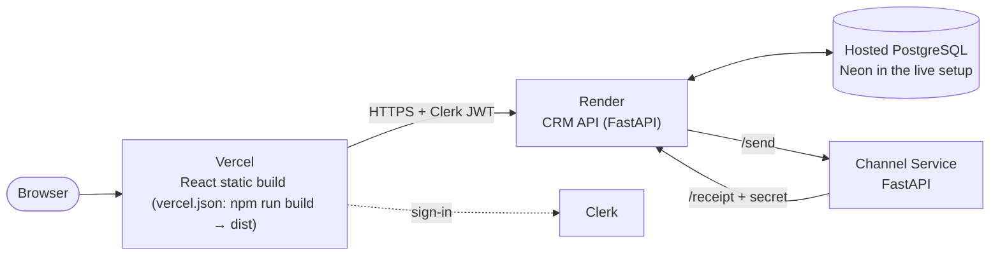
```mermaid
flowchart LR
    Browser(["Browser"]) --> V["Vercel<br/>React static build (vercel.json: npm run build → dist)"]
    V -- "HTTPS + Clerk JWT" --> R["Render<br/>CRM API (FastAPI)"]
    R <--> N[("Hosted PostgreSQL<br/>Neon in the live setup")]
    R -- "/send" --> C["Channel Service<br/>FastAPI"]
    C -- "/receipt + secret" --> R
    V -. "sign-in" .-> K["Clerk"]
```

Only `frontend/vercel.json` is committed as deployment config. The API's Render hosting is visible from its public URL; the Neon database and the channel service's hosting are not encoded in the repo. There is no CI, autoscaling, or monitoring configuration.

---

## 📸 Screenshots and Walkthrough

> **Heads-up:** the Dashboard, Customers, and Segments captures predate the INR and sample-feedback changes: they show `$` amounts and a "Customer reviews" panel, while the current code renders ₹ and a **"Sample customer feedback"** panel. Re-capture before treating them as current.

| Authentication | Dashboard |
|---|---|
| 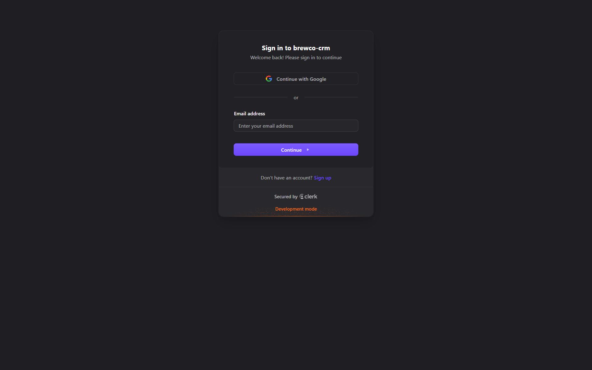 | 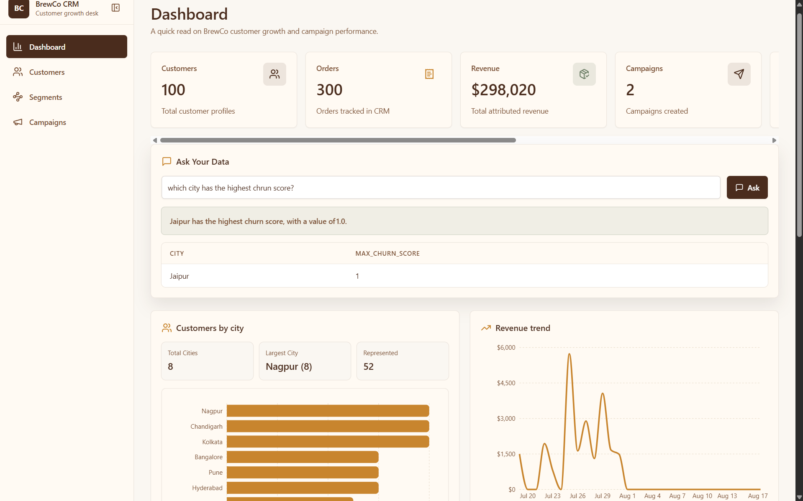 |

| Dashboard: funnel, top customers | Customers |
|---|---|
| 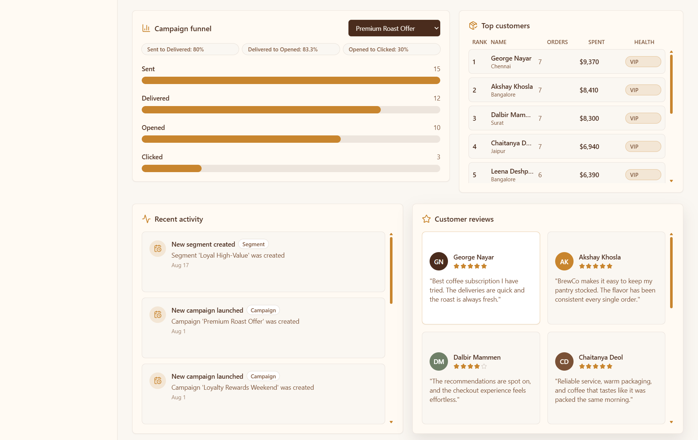 | 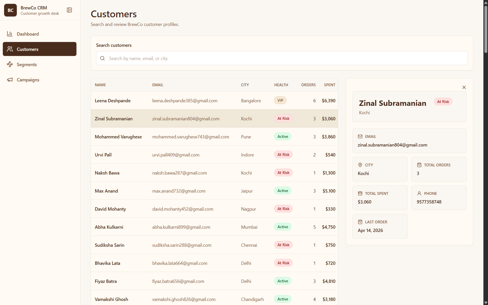 |

| Segments | Campaign creation |
|---|---|
| 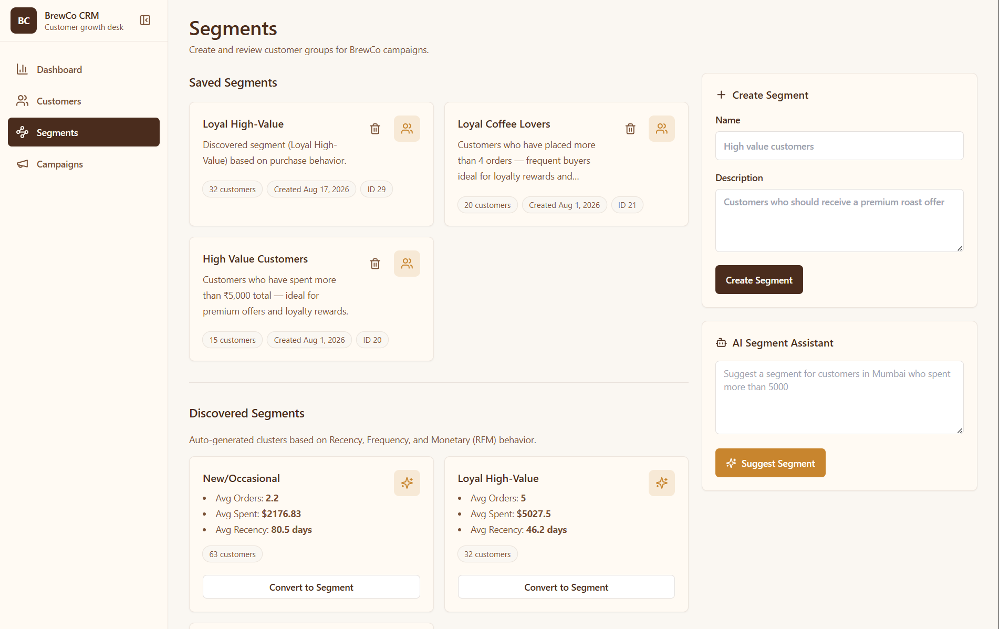 | 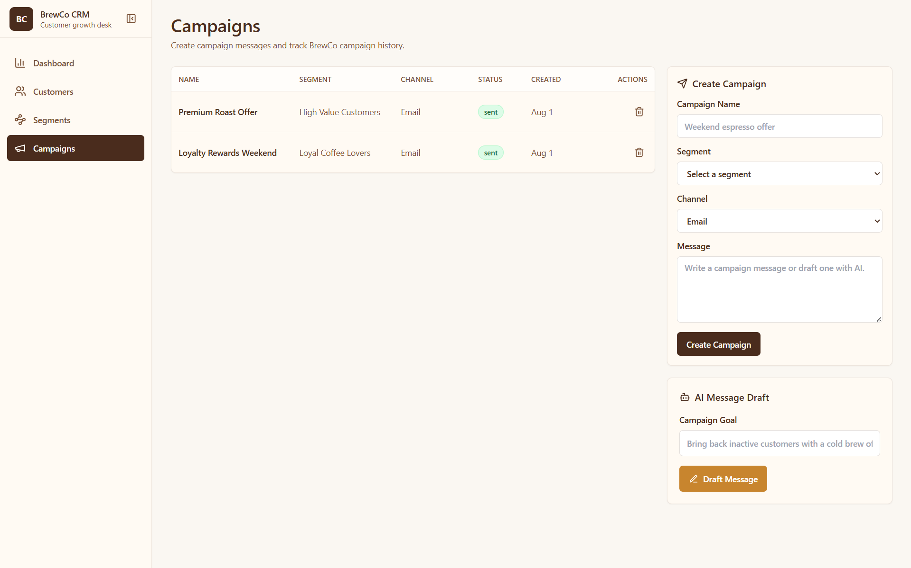 |

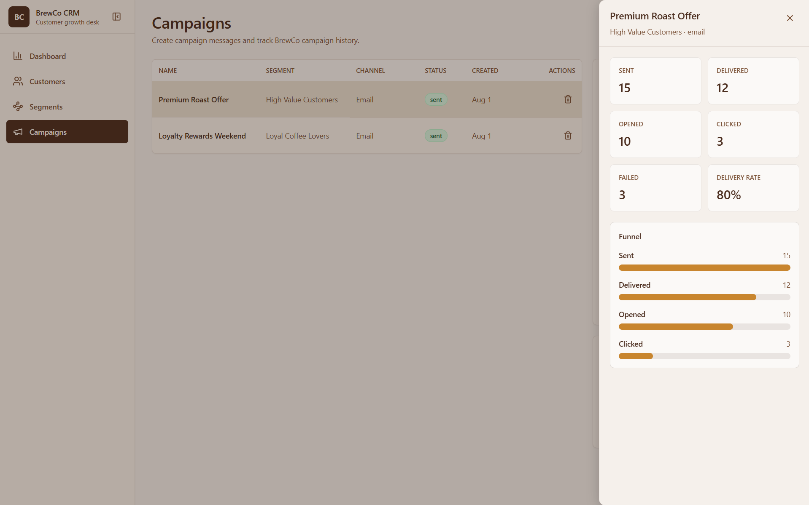

| Page | What you see | Backend support |
|---|---|---|
| **Dashboard** | KPI cards, Ask Your Data, city chart, revenue trend, funnel, top customers, activity, sample feedback | `/dashboard/*`, `/analytics/query`, `/customers`, `/campaigns/{id}/stats` |
| **Customers** | Search box, table with health badges, detail panel | `/customers` |
| **Segments** | Saved segments, discovered RFM clusters, create form, AI assistant | `/segments*`, `/ai/suggest-segment` |
| **Campaigns** | History table, create form with AI drafting, stats drawer | `/campaigns*`, `/ai/draft-message` |

**Feedback panel:** ten hard-coded quotes with static ratings under the placeholder name "Sample customer". It is **illustrative UI content, not real customer reviews**; no review source is connected.

---

## 🧩 Engineering Decisions

| Decision | Reason and trade-off |
|---|---|
| **Query spec instead of LLM-written SQL** | Validating a closed JSON schema is easier to reason about than filtering arbitrary SQL. Cost: only what the schema allows (single-level aggregates, fixed joins) is expressible. |
| **Parameterized SQL + read-only transaction** | Values never touch the SQL text; writes are refused by the database. Cost: read-only is per transaction, not a separate role. |
| **Separate channel service** | Real delivery is asynchronous; a second service forces the callback design (secret, fixed destination, receipts). Cost: another process, and it is a simulator. |
| **Clerk + JWKS** | No password handling or shared JWT secret. Cost: a hosted-identity dependency and no roles yet. |
| **Groq** | Short JSON and summary calls. Cost: prompts and allow-listed results leave the system, hence the PII boundary. |
| **Offline ML scoring** | Reads stay cheap; no model loading in the API. Cost: scores go stale until scripts rerun. |
| **FastAPI + asyncpg** | Async I/O for HTTP and DB fan-out; raw SQL keeps the builder transparent. Cost: no ORM or migration tool. |

---

## 🧪 Testing

Five standalone scripts in `backend/`, run directly with `python`; there is no pytest suite, CI, or coverage report. **The frontend has ESLint configured but no unit tests.**

| Script | Verifies | Needs |
|---|---|---|
| `tests_analytics_security.py` | 12 cases: unknown tables/columns, direct PII, unknown aggregate, malicious operator, limit > 100, injection-style value stays a parameter, valid queries and joins | Env vars only |
| `tests_segment_security.py` | 14 cases: empty/unknown/negative/mistyped filters, `min > max`, injection-style value, valid combos | Env vars only |
| `tests_analytics_pii_security.py` | Groq is mocked; asserts name/email/phone never appear in the summary prompt while city and spend do | Env vars only |
| `tests_receipt_security.py` | Missing key → 401, wrong key → 403, correct key passes the auth check | Env vars |
| `tests_historical_orders.py` | Backdated bulk orders never move `last_order_date` backwards | Live database (creates and removes a test customer) |

`core/config.py` fails fast, so set `DATABASE_URL`, `GROQ_API_KEY`, `CLERK_JWKS_URL`, and `CHANNEL_SERVICE_SECRET` first (dummy values work for the first four scripts).

---

## ⚠️ Known Limitations

- **Delivery is simulated.** No real email, SMS, or WhatsApp is sent; outcomes are random.
- **Single-tenant, no roles.** Any valid Clerk user can use every route. CORS is `*` on both services.
- **Channel `/send` is unauthenticated.** The shared secret protects only the callback direction.
- **Campaign processing is not durable.** It uses FastAPI background tasks, so a restart mid-dispatch can leave a campaign in `processing`; there are no retries, and receipts are not checked for ordering or idempotency.
- **Churn labels are rule-derived** and unevaluated (see [ML layer](#-segmentation-and-ml-layer)); `cluster_id` is not a stable identity across retrains, so a converted segment may match different customers after retraining.
- **ML scoring is manual.** New customers keep a default `churn_score` and are absent from discovered segments until scripts rerun.
- **No schema or migration tooling** beyond two `ALTER` scripts, and bulk insert endpoints loop without a wrapping transaction.
- **Read-only is not a separate role.** Analytics shares the API's connection pool, and results are not cached.
- **Sample data:** the feedback panel is static, and all demo customers and orders are synthetic; observability is limited to `print` and standard logging.

---

## 🔭 Future Work

*Not implemented today:*

- Durable job queue for dispatch, with retries and idempotent receipts
- Authenticated `/send`, restricted CORS, roles and multi-tenant scoping
- Real churn outcomes, held-out evaluation, and scheduled rescoring
- A dedicated read-only DB role for analytics
- A connected review source, schema migrations, and CI for the regression scripts

---

## 🐳 Tech Stack

| Layer | Choice |
|---|---|
| **Frontend** | React 18, Vite 6, Tailwind CSS 3, React Router 7, Axios, Recharts, Sonner, Lucide icons |
| **Backend** | FastAPI, Pydantic 2, `asyncpg`, PyJWT, `httpx` |
| **Database** | PostgreSQL |
| **Auth** | Clerk (`@clerk/clerk-react`, RS256 JWT verified via JWKS) |
| **AI** | Groq SDK, model `openai/gpt-oss-120b` |
| **ML** | scikit-learn: LogisticRegression, KMeans, StandardScaler, silhouette score |
| **Extra service** | FastAPI channel-delivery simulator |
| **Deployment** | Vercel (frontend), Render (API) |

---

<div align="center">

Built by **Debasish Kumar** · B.Tech CSE · [GitHub @Debasish65368](https://github.com/Debasish65368)

</div>